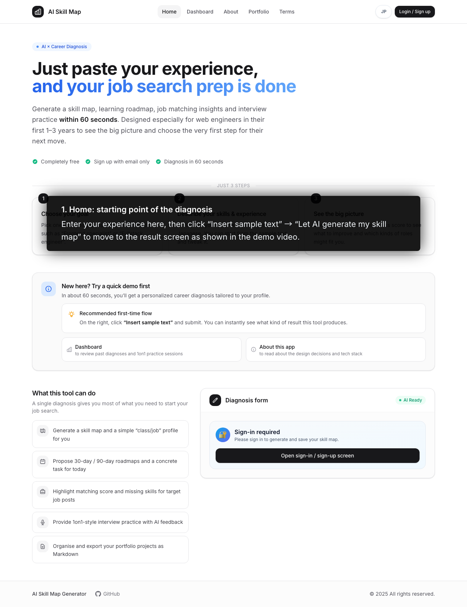
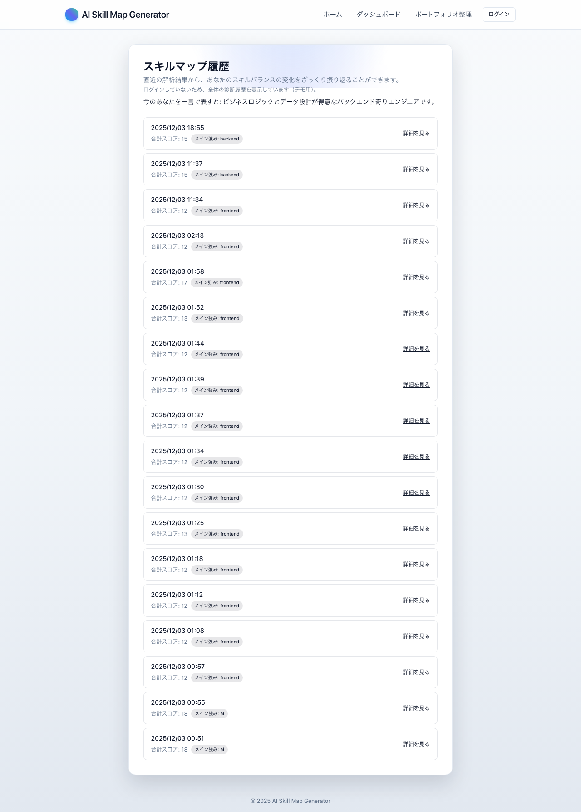
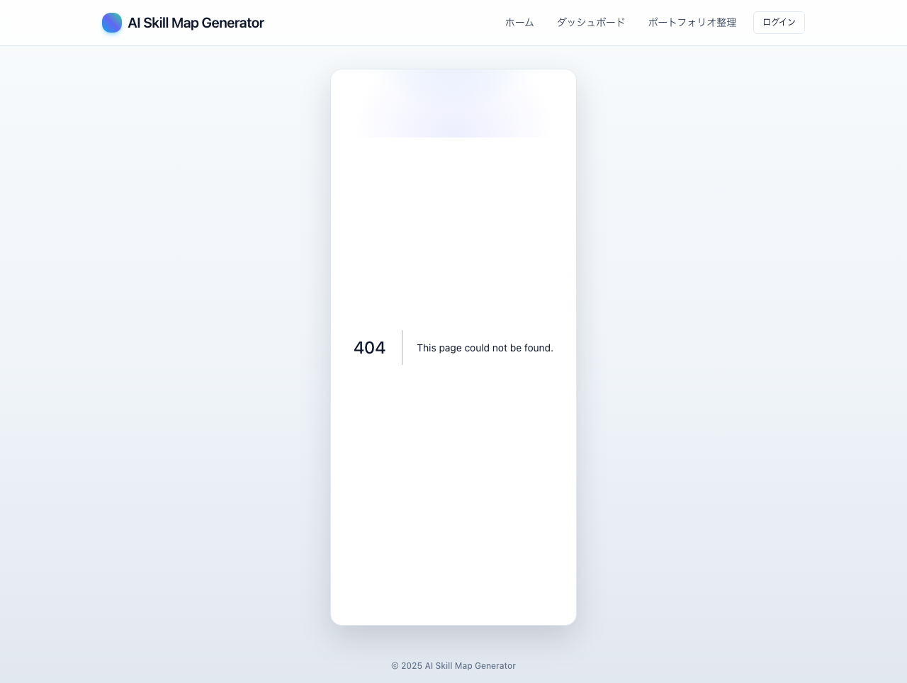
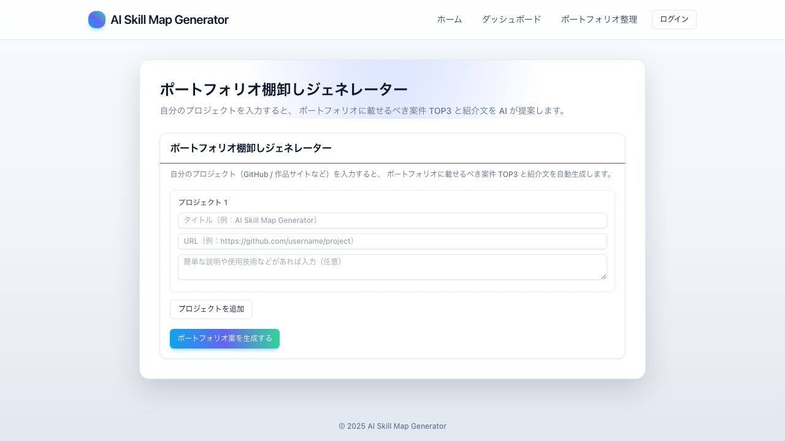
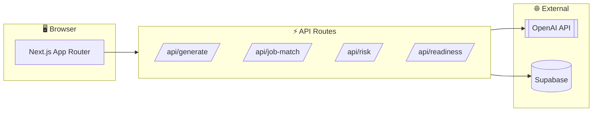

<h1 align="center">
  
  <br />
  AI Skill Map Generator
</h1>

<p align="center">
  <strong>🚀 スキルとキャリアを一枚のマップに</strong>
  <br />
  若手 Web エンジニアの「初めての転職」を AI がサポート
</p>

<p align="center">
  <a href="https://github.com/hashimotonobuaki123-cmyk/ai-skill-map-generator/actions/workflows/ci.yml">
    
  </a>
  
  
  
  
</p>

<p align="center">
  <a href="https://ai-skill-map-generator.vercel.app">🌐 Live Demo</a>
  ・
  <a href="#-features">✨ Features</a>
  ・
  <a href="#-tech-stack">🛠 Tech Stack</a>
  ・
  <a href="#-getting-started">🚀 Getting Started</a>
</p>

---

<p align="center">
  
</p>

---

## 📖 Overview

職務経歴やスキルセットを日本語で入力するだけで、AI が以下を自動生成します：

- 📊 **スキルマップ**（5カテゴリのレーダーチャート）
- 🗺️ **学習ロードマップ**（30日/90日プラン）
- 💼 **求人マッチング**（マッチ度スコア・不足スキル分析）
- 🎯 **転職準備スコア**（0-100点の総合評価）
- 📝 **ポートフォリオ整理**（案件TOP3とMarkdown出力）

---

## ✨ Features

<table>
  <tr>
    <td align="center" width="50%">
      
      <br />
      <strong>🎯 3ステップで診断</strong>
      <br />
      <small>ゴール選択 → スキル入力 → 結果確認</small>
    </td>
    <td align="center" width="50%">
      
      <br />
      <strong>📊 履歴ダッシュボード</strong>
      <br />
      <small>過去の診断結果を一覧表示</small>
    </td>
  </tr>
  <tr>
    <td align="center" width="50%">
      
      <br />
      <strong>ℹ️ 技術スタック紹介</strong>
      <br />
      <small>アプリの設計意図を解説</small>
    </td>
    <td align="center" width="50%">
      
      <br />
      <strong>📁 ポートフォリオ整理</strong>
      <br />
      <small>案件TOP3を自動選定</small>
    </td>
  </tr>
</table>

### 主要機能

| 機能 | 説明 |
|------|------|
| 🗺️ **スキルマップ** | Frontend / Backend / Infra / AI / Tools の5カテゴリでスキルを可視化 |
| 📈 **転職準備スコア** | スキル・求人マッチ・リスク・準備状況から総合スコアを算出 |
| 💼 **求人マッチング** | 求人票を貼り付けてマッチ度・不足スキルを分析 |
| ⚠️ **キャリアリスク** | 陳腐化・属人化・自動化リスクを数値化 |
| 🎤 **1on1 練習** | AI が面接官役となり、質問 → フィードバック |
| 📁 **ポートフォリオ整理** | 案件TOP3を選定し、Markdown形式で出力 |
| ⏰ **学習シミュレーター** | 週の学習時間から現実的な計画を提案 |

---

## 🛠 Tech Stack

### Frontend
- **Next.js 15** (App Router)
- **TypeScript** (strict mode)
- **Tailwind CSS** (カスタムデザインシステム)
- **Chart.js** / react-chartjs-2 (レーダーチャート)

### Backend
- **Next.js API Routes**
- **OpenAI API** (GPT-4o-mini)
- **Zod** (スキーマバリデーション)

### Database & Auth
- **Supabase** (PostgreSQL + Auth)
- Row Level Security (RLS) 対応

### Quality & Testing
- **Vitest** (ユニットテスト)
- **Playwright** (E2Eテスト)
- **ESLint** + **Prettier** (コード品質)
- **GitHub Actions** (CI/CD)

---

## 🏗 Architecture



---

## 🚀 Getting Started

### Prerequisites

- Node.js 18+
- npm / yarn / pnpm
- OpenAI API Key
- Supabase Project

### Installation

```bash
# リポジトリをクローン
git clone https://github.com/hashimotonobuaki123-cmyk/ai-skill-map-generator.git
cd ai-skill-map-generator

# 依存関係をインストール
npm install --legacy-peer-deps

# 環境変数を設定
cp .env.example .env.local
# .env.local を編集して API キーを設定
```

### Environment Variables

```env
OPENAI_API_KEY=your_openai_api_key
NEXT_PUBLIC_SUPABASE_URL=your_supabase_url
NEXT_PUBLIC_SUPABASE_ANON_KEY=your_supabase_anon_key
```

### Development

```bash
npm run dev      # 開発サーバー起動
npm run build    # プロダクションビルド
npm run test     # ユニットテスト
npm run lint     # ESLint
```

---

## 📁 Project Structure

```
ai-skill-map-generator/
├── app/                    # Next.js App Router
│   ├── api/               # API エンドポイント
│   ├── dashboard/         # ダッシュボードページ
│   ├── result/[id]/       # 結果ページ
│   └── ...
├── components/            # React コンポーネント
│   ├── ui/               # 汎用UIコンポーネント
│   └── ...
├── hooks/                 # カスタムフック
├── lib/                   # ユーティリティ
├── types/                 # TypeScript 型定義
└── tests/                 # テスト
```

---

## 📊 転職準備スコアの計算式

```
Total Score = SkillScore + JobScore + RiskScore + PrepScore
            = (0-40)    + (0-30)   + (0-20)    + (0-10)
            = 0-100 points
```

| スコア | レベル | 説明 |
|--------|--------|------|
| 75+ | 🟢 High | 今すぐ転職活動を始められる状態 |
| 45-74 | 🟡 Medium | 少し準備すれば十分戦える状態 |
| 0-44 | 🔴 Low | 1-2ヶ月の土台固めを推奨 |

---

## 🎯 このプロジェクトのポイント

### 1. AI × キャリアの具体的なプロダクト設計
- エンジニア転職の実務フロー（スキル棚卸し → ロードマップ → 求人マッチ → 面接準備）を1つのアプリにストーリーとして落とし込み
- 「転職準備スコア」「キャリアリスクレーダー」「求人マッチング」など、実務で意思決定に使える指標設計

### 2. 型安全・テストまで含めたフルスタック実装
- Next.js（App Router）+ TypeScript + Supabase + OpenAI で、フロント〜API〜DB まで一通り自分で設計・実装
- Zod による API 入力バリデーション、純粋関数に切り出したスコア計算、Vitest + Playwright によるテスト

### 3. ポートフォリオとしての読みやすさ
- 「3分で一周できるフロー」を意識した画面構成・タブ・ボタン文言
- モバイル対応、情報カードの統一感、使いやすい UI/UX

---

## 📝 License

MIT License - see the [LICENSE](LICENSE) file for details.

---

<p align="center">
  Made with ❤️ by <a href="https://github.com/hashimotonobuaki123-cmyk">hashimotonobuaki123-cmyk</a>
</p>
