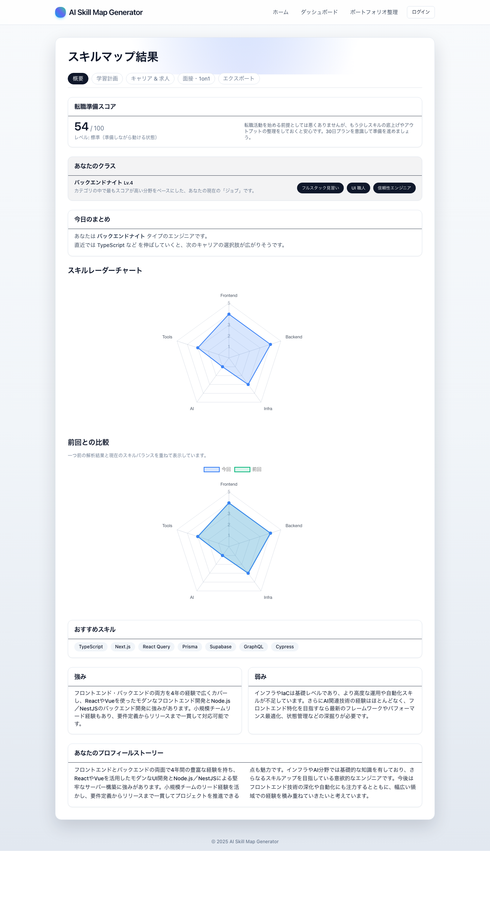
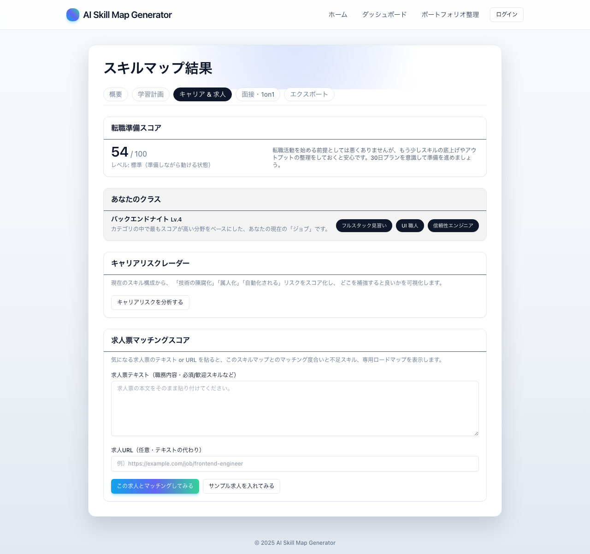
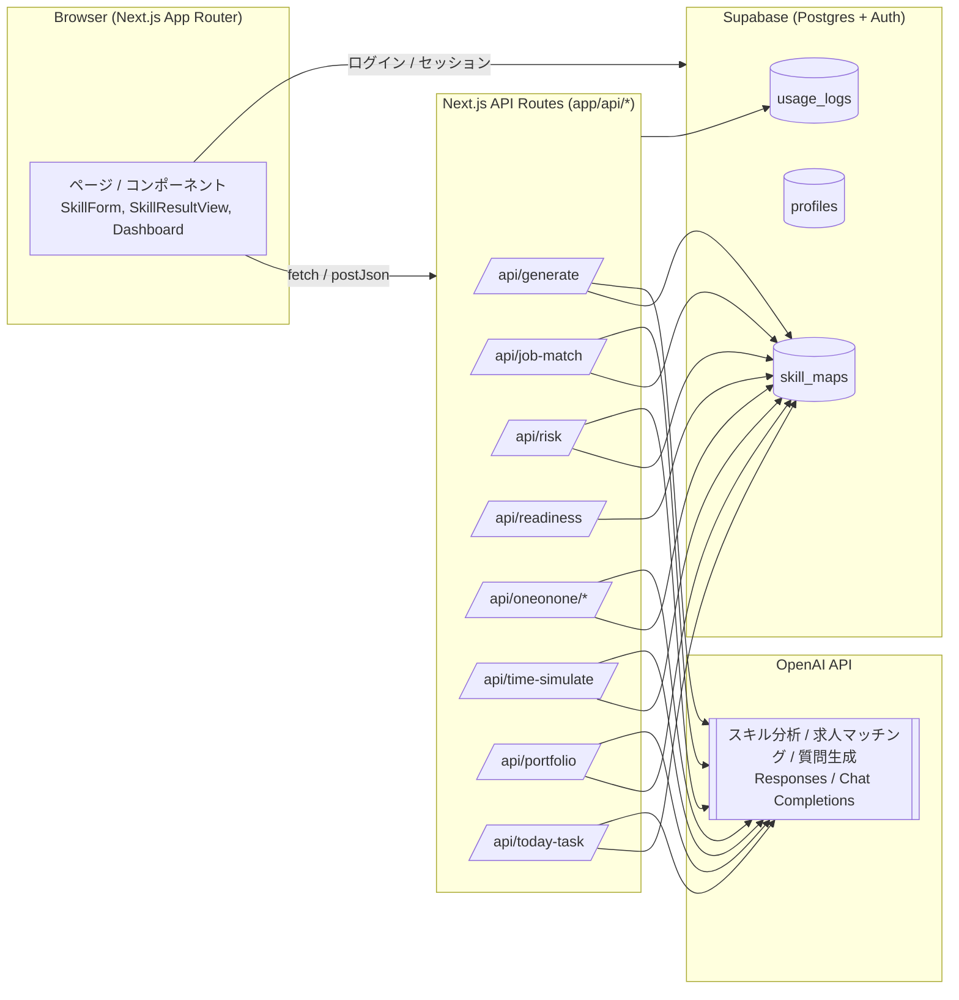
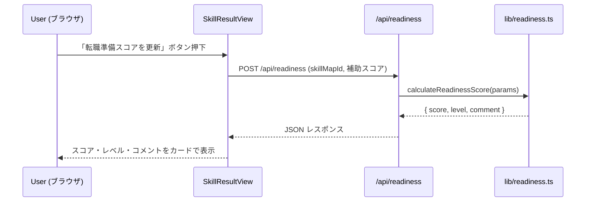

## AI Skill Map Generator

**🚀 AI-powered career coaching tool for engineers: skill assessment, learning roadmap, job matching & interview practice**

[](https://github.com/hashimotonobuaki123-cmyk/ai-skill-map-generator/actions/workflows/ci.yml)
[](https://codecov.io/gh/hashimotonobuaki123-cmyk/ai-skill-map-generator)
[](https://www.typescriptlang.org/)
[](https://nextjs.org/)
[](https://supabase.com/)
[](https://opensource.org/licenses/MIT)

> 🎯 若手 Web エンジニアの「初めての転職」を想定した、AI ベースのスキルマップ・キャリアコーチングツール

スキル・職務経歴を入力すると、**スキルマップ / 学習ロードマップ / 求人マッチング / 面接練習 / ポートフォリオ整理** まで一通りサポートします。

この README は、**採用担当・エンジニアの方に向けて「このプロジェクトで何ができるか / どんな力があるか」を短時間で掴んでもらうこと**を意図して構成しています。

📖 [English version](./README.en.md)

---

### このプロジェクトで見てほしいポイント（サマリ）

- **1. AI × キャリアの具体的なプロダクト設計**
  - エンジニア転職の実務フロー（スキル棚卸し → ロードマップ → 求人マッチ → 面接準備）を、1つのアプリにストーリーとして落とし込んでいます。
  - 「転職準備スコア」「キャリアリスクレーダー」「求人マッチング」など、**実務で意思決定に使える指標設計**を意識しています。

- **2. 型安全・検証・テストまで含めたフルスタック実装**
  - Next.js（App Router）＋ TypeScript + Supabase + OpenAI で、**フロント〜API〜DB まで一通り自分で設計・実装**しています。
  - Zod による API 入力バリデーション、純粋関数に切り出したスコア計算、Vitest + Playwright によるテストなど、**壊れにくさと説明可能性**を重視しています。

- **3. ポートフォリオとしての読みやすさ・体験**
  - 「3分で一周できるフロー」を意識して画面構成・タブ・ボタン文言を設計し、モバイル対応や情報カードの統一感も調整しています。
  - ログイン機能・履歴ダッシュボード・使用ログなど、**実際に使うサービスとしての “現実味”** を持たせています。

---

### プロダクト概要（何を解決するか）

ターゲットは、**初めて転職を考える 20〜30 代の Web エンジニア**です。

- どのスキルがどれくらい評価されるのか、客観的に整理できない
- 「転職活動の準備がどれくらいできているか」を数値で把握しづらい
- 気になる求人に対して「自分はどれくらいフィットしているのか」がわかりにくい
- 面接や 1on1 で、自分の経験をうまく言語化できない

といった課題に対して、このアプリは次のような体験を提供します。

- スキル・職務経歴を入力すると、**カテゴリ別スキルマップ（Frontend / Backend / Infra / AI / Tools）と強み・弱みの言語化**
- 30日 / 90日ロードマップによる「何から手を付けるべきか」の可視化
- 求人票マッチングスコア（マッチ度%・不足スキルTOP3・求人向けミニロードマップ）
- キャリアリスクレーダー（陳腐化 / 属人化 / 自動化リスク）の可視化
- ポートフォリオ棚卸しジェネレーター（案件TOP3と Markdown 出力）
- **転職面接練習モード（一般面接 / 技術面接 / 行動面接）** ← NEW!

---

### 転職面接練習機能（ハイライト）

このアプリの目玉機能の一つが「転職面接練習モード」です。

#### 何ができるか

- **3種類の面接タイプ**から選んで練習
  - 💬 **一般面接**: 自己紹介・志望動機・キャリアプラン
  - 💻 **技術面接**: 技術スタック・設計判断・問題解決能力
  - 🎯 **行動面接**: STAR法（状況→課題→行動→結果）による深掘り

- **パーソナライズされた質問生成**: スキルマップの分析結果をもとに、あなたの強み・弱みに合わせた面接質問をAIが自動生成

- **回答品質のリアルタイム評価**: 文字数・具体性・構造・STAR要素をルールベースで自動スコアリング + AIによる詳細フィードバック

- **模範回答の提示**: 各質問に対して、あなたの回答を踏まえた改善版の模範回答を生成

- **セッション総評**: 練習終了時に「良かった点」「改善点」「次回までの宿題」を含む総合評価を表示

- **成長の可視化**: 練習履歴を保存し、過去のスコアと比較して成長を実感

#### 設計のポイント

- **ルールベース評価 + AI評価のハイブリッド**: 文字数やSTAR要素の有無は純粋関数で高速に判定し、その結果をAIのプロンプトにも渡すことで、より的確なフィードバックを生成
- **面接タイプ別のプロンプト最適化**: 一般/技術/行動それぞれに特化した評価基準とフィードバック方針を設定
- **モバイル対応 & アクセシビリティ**: タップ領域の確保、キーボードナビゲーション、aria属性の適切な設定

---

### 3分でわかるユーザーフロー

1. **ゴールを選ぶ**  
   ホームで「目指したいキャリア」（例：フロントエンドエンジニア、フルスタックなど）を選択。

2. **スキル・職務経歴を入力**  
   スキルセット、これまでの職務経歴、GitHub / ポートフォリオ URL を入力し、AI 解析を実行。

3. **スキルマップと転職準備スコアを確認**  
   結果画面の「概要」タブで、レーダーチャート・強み/弱み・転職準備スコアをざっと確認。

4. **求人票マッチングとキャリアリスクを確認**  
   - 「キャリア・求人」タブで気になる求人票を貼り付け、マッチングスコアと不足スキルを確認  
   - 同じタブ内でキャリアリスク（陳腐化 / 属人化 / 自動化リスク）のレーダーチャートを確認

5. **面接練習で本番に備える**  
   - 「面接練習」タブで、一般 / 技術 / 行動の3タイプから練習したい面接を選択  
   - 5〜7問の質問に回答し、AIからフィードバックと模範回答をもらう  
   - セッション終了時の総評で、次回までの改善ポイントを確認

6. **職務経歴書用アウトプットをコピー**  
   「エクスポート」タブから、Markdown / JSON / 職務経歴書テンプレートをコピーして、応募資料の叩き台にする。

---

### 画面イメージ（スクリーンショット）

UI の雰囲気が 1〜2 枚で伝わるように、代表的な画面だけを載せています（`npm run screenshot` で自動生成した画像を使用）。

- **ホーム（スキル入力と 3 ステップ導線）**

  

- **スキルマップ結果（概要タブ）**

  

- **キャリア & 求人タブ（求人マッチング＋キャリアリスク）**

  

- **このアプリについて**

  

スクリーンショットを撮り直したい場合は、ローカルで `npm run dev` を起動したうえで `npm run screenshot` を実行し、生成された `public/screenshots/*.png` をコミットしてください。

---

### ドキュメント

- 詳細な機能仕様: `docs/spec.md`
- 英語版サマリ: `docs/spec.en.md`
- API の入出力サマリ: `docs/api.md`
- 設計意図・今後の改善メモ: `docs/design-notes.md`

---

### 技術構成（ハイレベル）

- **フロントエンド**
  - Next.js 15 (App Router)
  - TypeScript
  - Tailwind CSS
  - shadcn 風 UI コンポーネント
  - Chart.js / react-chartjs-2（レーダーチャート）

- **バックエンド / API**
  - Next.js Route Handlers（`app/api/*`）
  - OpenAI Node SDK（スキル分析・求人マッチング・1on1 質問生成など）
  - Zod によるリクエストスキーマ定義（`types/api.ts`）

- **データストア / 認証**
  - Supabase（Postgres, Auth）
  - テーブル例：`profiles`, `skill_maps`, `usage_logs`
  - Email + パスワード認証（Supabase Auth）

---

### アーキテクチャ概要（少し詳しめ）

- **フロントエンド**
  - `app/page.tsx`  
    スキル入力フォーム（キャリアゴール・職務経歴・GitHub URL・サンプル文挿入ボタンなど）
  - `app/result/[id]/page.tsx`  
    スキルマップ結果・ロードマップ・求人マッチング・1on1 などをタブ構成で表示
  - `app/dashboard/page.tsx`  
    過去のスキルマップ一覧と、メイン強みカテゴリのバッジ表示
  - `components/SkillResultView.tsx`  
    結果画面の中核。タブ、レーダーチャート、今日のまとめ、各種 AI 機能セクションを統合。

- **バックエンド（Next.js API Routes）**
  - `/api/generate`  
    OpenAI にスキル分析を依頼し、Supabase の `skill_maps` に保存。
  - `/api/job-match`  
    求人票テキスト/URL とスキルマップからマッチングスコア・不足スキル・求人向けロードマップを生成。
  - `/api/risk`  
    キャリアリスク（陳腐化 / 属人化 / 自動化）をスコアリング。
  - `/api/readiness`  
    `lib/readiness.ts` の純粋関数で「転職準備スコア」を算出。
  - `/api/oneonone/questions`  
    スキルマップと面接タイプに基づいた面接質問を生成。
  - `/api/oneonone/feedback`  
    回答に対するAIフィードバック + ルールベース評価スコアを返却。
  - `/api/oneonone/summary`  
    セッション全体の総評（良かった点・改善点・次の宿題）を生成。
  - `/api/oneonone/sessions`  
    練習履歴の保存・取得。
  - その他 `/api/time-simulate`, `/api/portfolio`, `/api/today-task` など、  
    転職活動の周辺体験を支える補助 API 群。

- **データストア**
  - Supabase Postgres の `skill_maps` テーブルに解析結果を保存。
  - `interview_sessions` テーブルに面接練習の履歴を保存。
  - `profiles` でユーザープロファイル、`usage_logs` で機能ごとの利用ログを管理。

> 📐 詳細なアーキテクチャ図（Mermaid）は [docs/architecture.md](./docs/architecture.md) を参照してください。

---

### システム構成図

```
┌─────────────────────────────────────────────────────────────┐
│                     Client (Browser)                         │
│  ┌─────────────┐  ┌─────────────┐  ┌─────────────┐          │
│  │   Home      │  │  Dashboard  │  │   Result    │          │
│  │ (入力)      │  │  (履歴)     │  │  (タブ)     │          │
│  └──────┬──────┘  └──────┬──────┘  └──────┬──────┘          │
└─────────┼────────────────┼────────────────┼─────────────────┘
          │                │                │
          ▼                ▼                ▼
┌─────────────────────────────────────────────────────────────┐
│                    Next.js API Routes                        │
│  ┌──────────┐ ┌──────────┐ ┌──────────┐ ┌──────────┐        │
│  │/generate │ │/job-match│ │/oneonone │ │/risk     │        │
│  └────┬─────┘ └────┬─────┘ └────┬─────┘ └────┬─────┘        │
│       │            │            │            │               │
│       │      ┌─────┴────────────┴────────────┘               │
│       │      │  lib/answerEvaluator.ts (ルールベース評価)    │
│       │      │  lib/readiness.ts (スコア算出)                │
└───────┼──────┼──────────────────────────────────────────────┘
        │      │
        ▼      ▼
┌───────────────┐  ┌───────────────────────────────────────────┐
│   Supabase    │  │              OpenAI API                   │
│  (PostgreSQL) │  │         (GPT-4.1-mini)                    │
│               │  │                                           │
│ skill_maps    │  │  - スキル分析                             │
│ interview_    │  │  - 面接質問生成                           │
│   sessions    │  │  - フィードバック生成                     │
│ usage_logs    │  │  - 総評生成                               │
└───────────────┘  └───────────────────────────────────────────┘
```

---

### 品質・安全性・運用面で意識していること

- **型安全性・バリデーション**
  - すべての API 入力を Zod スキーマ（`types/api.ts`）でバリデーションし、  
    TypeScript の型と runtime の整合性を確保。
  - フロントエンドからの API 呼び出しは `lib/apiClient.ts` の `postJson` に統一し、  
    エラーハンドリングと型定義を共通化。

- **ビジネスロジックの分離**
  - 「転職準備スコア」の算出ロジックを `lib/readiness.ts` の純粋関数として切り出し、  
    API 層からは関数呼び出しのみにすることでテストしやすくしています。
  - 「回答品質スコア」の評価ロジックを `lib/answerEvaluator.ts` として分離し、  
    文字数・具体性・構造・STAR要素をルールベースで評価。AIフィードバックと組み合わせて使用。

- **テスト**
  - `lib/readiness.test.ts`（Vitest）で転職準備スコアの 3 パターンをユニットテスト。
  - `lib/answerEvaluator.test.ts`（Vitest）で回答品質評価の 13 パターンをユニットテスト。
  - `tests/e2e/basic-flow.spec.ts` / `tests/e2e/screenshot.spec.ts`（Playwright）で、基本フローとスクリーンショット取得を自動化。
  - `tests/e2e/interview-practice.spec.ts`（Playwright）で、面接練習機能のUI表示・アクセシビリティを検証。

- **CI（継続的インテグレーション）**
  - GitHub Actions（`.github/workflows/ci.yml`）で、`npm run build` と `npm run test`（readiness のユニットテスト）を自動実行し、ビルドと主要なロジックが常に通る状態を保つようにしています。

- **ログ・運用**
  - `usage_logs` テーブルと `lib/usageLogger.ts` を用意し、  
    「どの機能がどれだけ使われているか」を簡易的に記録できるようにしています。

- **認証とデータ保護**
  - Supabase Auth による Email + パスワード認証。
  - `skill_maps.user_id` にユーザ ID を保存し、ダッシュボードではログインユーザに紐づくデータを優先表示。  
  - Supabase Row Level Security（RLS）を前提に、ユーザ毎にスキルマップを分離する設計を想定（ポリシー例を `supabase/schema.sql` にコメントとして記載）。

---

### アーキテクチャ図（mermaid）

GitHub 上で mermaid を用いて、全体像と主要なフローを簡単に図示しています。

#### 全体アーキテクチャ（Browser → Next.js → Supabase / OpenAI）



#### `/api/readiness` のシーケンス（転職準備スコア）



---

### 転職準備スコアの計算式（概要）

`lib/readiness.ts` では、スコアを以下の 4 要素から 0〜100 点で算出しています。

- **スキルスコア（0〜40 点）**  
  - フロントエンド / バックエンド / インフラ / AI / ツールの 5 カテゴリのレベル平均を \(\bar{L}\) とすると、
  - \[
      \text{skillScore} = \text{clamp}\left(\frac{\bar{L}}{5} \times 40,\ 0,\ 40\right)
    \]

- **求人マッチングスコア（0〜30 点）**  
  - 求人マッチング API のスコアを \(M\)（0〜100）とすると、
  - \[
      \text{jobScore} = \text{clamp}\left(\frac{M}{100} \times 30,\ 0,\ 30\right)
    \]
  - 求人マッチングが未実行の場合は \(M=50\) を仮置きしています。

- **キャリアリスクスコア（0〜20 点）**  
  - 陳腐化 / 属人化 / 自動化リスクをそれぞれ \(R_1, R_2, R_3\)（0〜100）とし、その平均を \(\bar{R}\) とすると、
  - \[
      \text{riskScore} = \text{clamp}\left(\frac{100 - \bar{R}}{100} \times 20,\ 0,\ 20\right)
    \]
  - リスクが低いほど（値が小さいほど）スコアが高くなるように反転させています。

- **準備スコア（0〜10 点）**  
  - 面接練習やポートフォリオ整備など、「準備状況」を表す外部スコアを \(P\)（0〜10）として直接採用。
  - 指定がない場合は中間の 5 点を採用しています。

最終スコアは、これらを単純加算したものです。

\[
  \text{total} = \text{round}(\text{skillScore} + \text{jobScore} + \text{riskScore} + \text{prep})
\]

スコアに応じて、以下の 3 段階でレベルとコメントを返しています。

- 75 点以上: **high**（「今すぐにでも転職活動を始められる状態」）  
- 45〜74 点: **medium**（「少し整えれば十分戦える状態」）  
- 44 点以下: **low**（「まずは 1〜2 ヶ月の土台固めを推奨」）

---

### 認証（メールアドレス + パスワード）

- Supabase Auth の設定で Email 認証を有効化し、開発中はメール確認をオフにしておくと動作確認しやすいです。  
- 画面右上の「ログイン」ボタンから `/auth/login` に遷移し、メールアドレスとパスワードで新規登録 / ログインできます。  
- ログインすると `auth.getUser().id` が `skill_maps.user_id` に保存され、`/dashboard` ではそのユーザーに紐づく診断結果のみを一覧表示します（未ログイン時は全体の履歴をデモ用として参照）。

---

### 開発者向け情報（セットアップ・コマンド）

#### 環境変数

プロジェクト直下に `.env.local` を作成し、以下を定義してください。

```bash
OPENAI_API_KEY=your_openai_api_key
NEXT_PUBLIC_SUPABASE_URL=your_supabase_url
NEXT_PUBLIC_SUPABASE_ANON_KEY=your_supabase_anon_key
```

#### セットアップ

```bash
npm install --legacy-peer-deps
```

※ Next.js 15 / React 19 RC と一部ライブラリの peerDependencies の都合で、`--legacy-peer-deps` を付けてインストールする想定です。  
※ Supabase 側のテーブルは `supabase/schema.sql` をコンソール等で実行して作成してください。

#### 開発用コマンド

```bash
npm run dev      # 開発サーバ
npm run test     # 転職準備スコアなどのユニットテスト
npm run test:e2e # Playwright による簡易E2Eテスト
npm run screenshot # 主要画面のスクリーンショット自動撮影
```

`npm run dev` 実行後、ターミナルに表示される **Local** の URL（例: `http://localhost:3002`）にブラウザでアクセスするとアプリが表示されます（ホーム `/` からスキル診断を開始できます）。

---

### スクリーンショット（自動生成）

ポートフォリオ用に、主要画面のスクリーンショットを自動で撮影する Playwright スクリプトを用意しています。

- `tests/e2e/screenshot.spec.ts`  
  - ホーム `/`
  - ダッシュボード `/dashboard`
  - ポートフォリオ整理 `/portfolio`
  - このアプリについて `/about`
  の 4 画面を開き、`public/screenshots/*.png` に保存します。

ローカルで `npm run dev` を起動したうえで、別ターミナルから以下を実行してください。

```bash
npm run screenshot
```

生成された画像をそのまま README に貼る場合の例:

```markdown


```

---

### 最後に（自分のアピールポイント）

このプロジェクトでは、単なる「AI API を叩くデモ」ではなく、

- **転職活動という具体的な文脈の中で、ユーザーストーリーから機能を設計したこと**
- **Next.js / Supabase / OpenAI / Zod / テストなど、モダンなフルスタック構成を一人で組み上げたこと**
- **UI/UX・エラーメッセージ・モバイル対応・使用ログなど、細かい体験も含めて磨き込んだこと**

を意識しています。

もしコードや設計の意図について詳しくご覧になりたい場合は、`lib/`, `app/api/`, `components/` 配下のコメントや型定義も含めてチェックしていただけると嬉しいです。

---

### 制約・注意点（利用者向け）
- このアプリは個人のポートフォリオ用途であり、商用サービスとしての提供を前提としていません。
- 入力されたデータは Supabase（Postgres）上に保存されますが、第三者への提供は行いません。
- スキルマップの保存・履歴表示はログインユーザーのみ対象です（未ログイン時は生成自体ができません）。
- パスワードの忘失やアカウント削除については `/auth/reset` と `/auth/delete` から自己対応できるようにしています。
