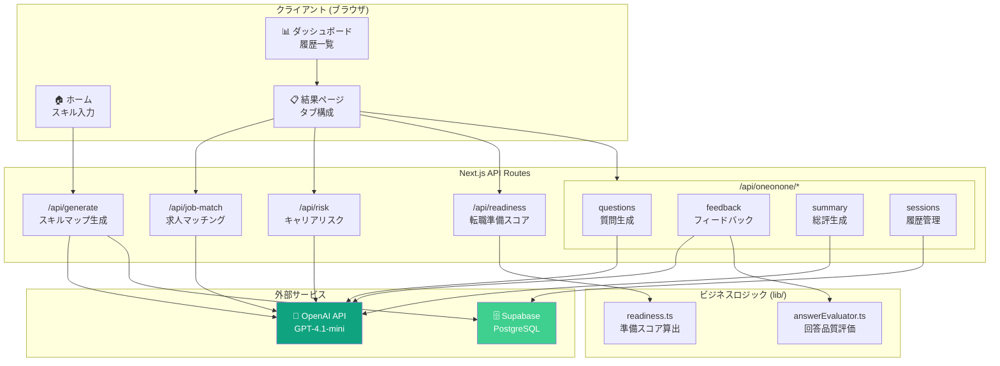
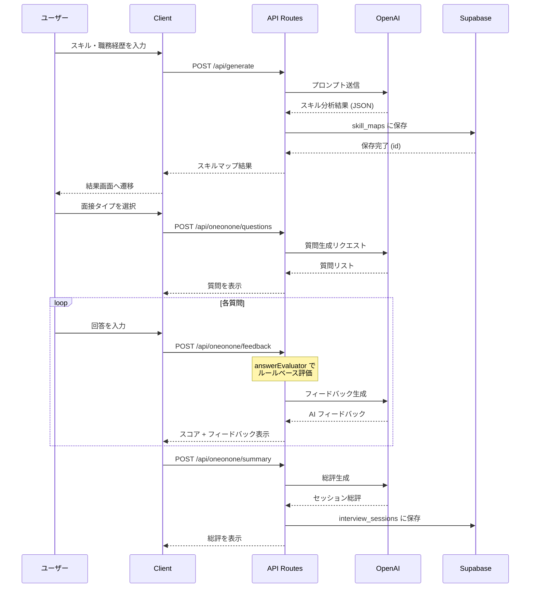
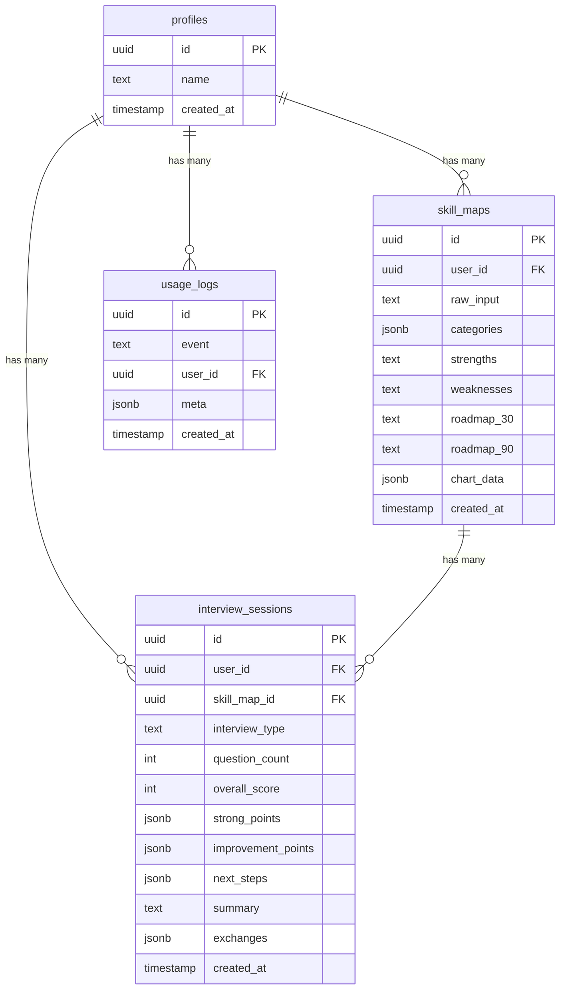
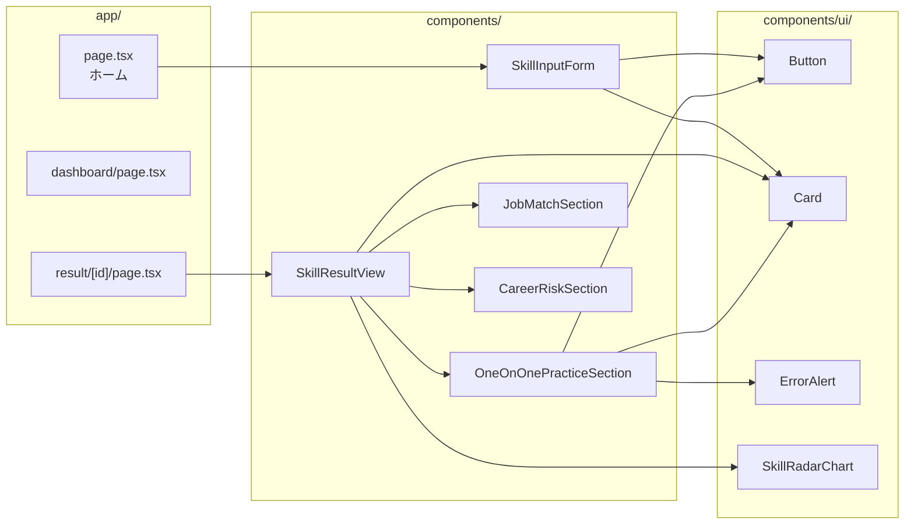
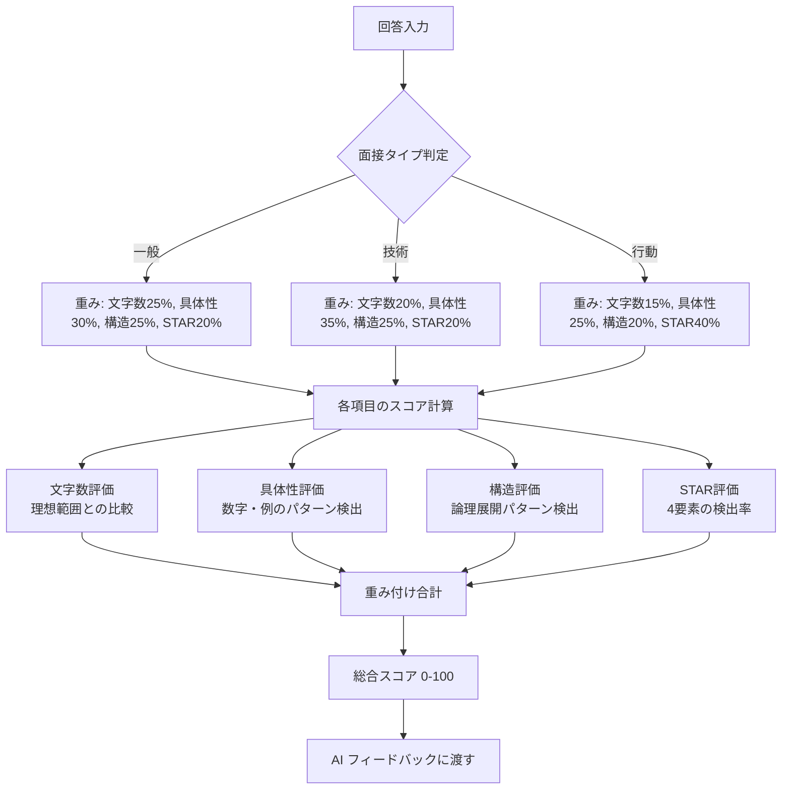
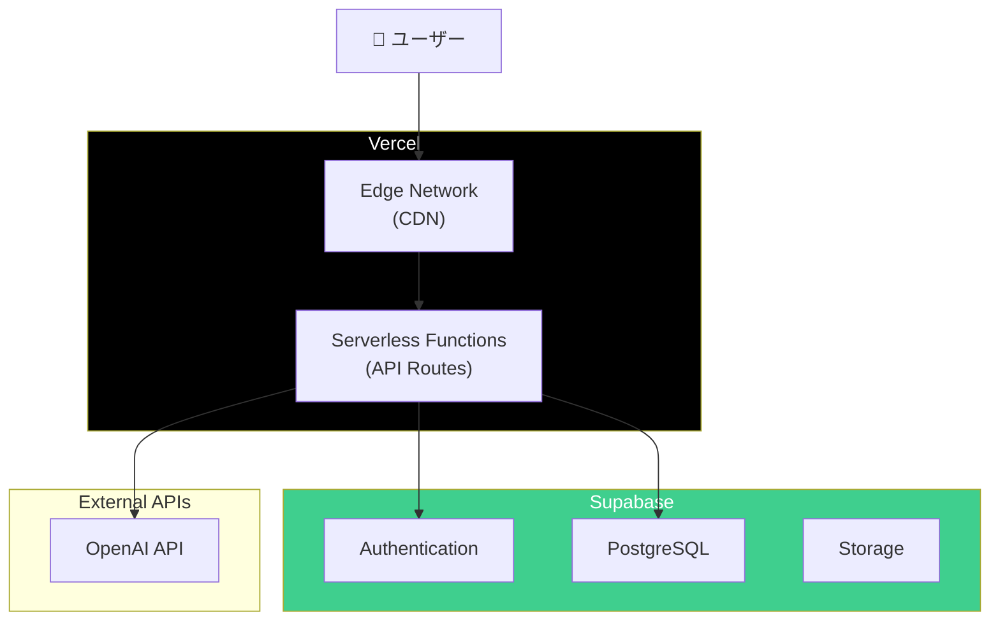

# アーキテクチャ概要

## システム全体図

```mermaid
graph TB
    subgraph Client["クライアント (ブラウザ)"]
        Home["🏠 ホーム<br/>スキル入力"]
        Dashboard["📊 ダッシュボード<br/>履歴一覧"]
        Result["📋 結果ページ<br/>タブ構成"]
    end

    subgraph NextJS["Next.js API Routes"]
        Generate["/api/generate<br/>スキルマップ生成"]
        JobMatch["/api/job-match<br/>求人マッチング"]
        Risk["/api/risk<br/>キャリアリスク"]
        Readiness["/api/readiness<br/>転職準備スコア"]
        
        subgraph Interview["/api/oneonone/*"]
            Questions["questions<br/>質問生成"]
            Feedback["feedback<br/>フィードバック"]
            Summary["summary<br/>総評生成"]
            Sessions["sessions<br/>履歴管理"]
        end
    end

    subgraph External["外部サービス"]
        OpenAI["🤖 OpenAI API<br/>GPT-4.1-mini"]
        Supabase["🗄️ Supabase<br/>PostgreSQL"]
    end

    subgraph Lib["ビジネスロジック (lib/)"]
        AnswerEval["answerEvaluator.ts<br/>回答品質評価"]
        ReadinessCalc["readiness.ts<br/>準備スコア算出"]
    end

    Home --> Generate
    Dashboard --> Result
    Result --> JobMatch
    Result --> Risk
    Result --> Readiness
    Result --> Interview

    Generate --> OpenAI
    Generate --> Supabase
    JobMatch --> OpenAI
    Risk --> OpenAI
    Questions --> OpenAI
    Feedback --> OpenAI
    Feedback --> AnswerEval
    Summary --> OpenAI
    Sessions --> Supabase
    Readiness --> ReadinessCalc

    style OpenAI fill:#10a37f,color:#fff
    style Supabase fill:#3fcf8e,color:#fff
```

## データフロー

```mermaid
sequenceDiagram
    participant U as ユーザー
    participant C as Client
    participant A as API Routes
    participant O as OpenAI
    participant S as Supabase

    %% スキルマップ生成フロー
    U->>C: スキル・職務経歴を入力
    C->>A: POST /api/generate
    A->>O: プロンプト送信
    O-->>A: スキル分析結果 (JSON)
    A->>S: skill_maps に保存
    S-->>A: 保存完了 (id)
    A-->>C: スキルマップ結果
    C-->>U: 結果画面へ遷移

    %% 面接練習フロー
    U->>C: 面接タイプを選択
    C->>A: POST /api/oneonone/questions
    A->>O: 質問生成リクエスト
    O-->>A: 質問リスト
    A-->>C: 質問を表示

    loop 各質問
        U->>C: 回答を入力
        C->>A: POST /api/oneonone/feedback
        Note over A: answerEvaluator で<br/>ルールベース評価
        A->>O: フィードバック生成
        O-->>A: AI フィードバック
        A-->>C: スコア + フィードバック表示
    end

    C->>A: POST /api/oneonone/summary
    A->>O: 総評生成
    O-->>A: セッション総評
    A->>S: interview_sessions に保存
    A-->>C: 総評を表示
```

## データベース設計

```mermaid
erDiagram
    profiles {
        uuid id PK
        text name
        timestamp created_at
    }
    
    skill_maps {
        uuid id PK
        uuid user_id FK
        text raw_input
        jsonb categories
        text strengths
        text weaknesses
        text roadmap_30
        text roadmap_90
        jsonb chart_data
        timestamp created_at
    }
    
    interview_sessions {
        uuid id PK
        uuid user_id FK
        uuid skill_map_id FK
        text interview_type
        int question_count
        int overall_score
        jsonb strong_points
        jsonb improvement_points
        jsonb next_steps
        text summary
        jsonb exchanges
        timestamp created_at
    }
    
    usage_logs {
        uuid id PK
        text event
        uuid user_id FK
        jsonb meta
        timestamp created_at
    }

    profiles ||--o{ skill_maps : "has many"
    profiles ||--o{ interview_sessions : "has many"
    profiles ||--o{ usage_logs : "has many"
    skill_maps ||--o{ interview_sessions : "has many"
```

## コンポーネント構成

```mermaid
graph LR
    subgraph Pages["app/"]
        P1["page.tsx<br/>ホーム"]
        P2["dashboard/page.tsx"]
        P3["result/[id]/page.tsx"]
    end

    subgraph Components["components/"]
        C1["SkillInputForm"]
        C2["SkillResultView"]
        C3["OneOnOnePracticeSection"]
        C4["JobMatchSection"]
        C5["CareerRiskSection"]
    end

    subgraph UI["components/ui/"]
        U1["Button"]
        U2["Card"]
        U3["ErrorAlert"]
        U4["SkillRadarChart"]
    end

    P1 --> C1
    P3 --> C2
    C2 --> C3
    C2 --> C4
    C2 --> C5
    C1 --> U1
    C1 --> U2
    C2 --> U2
    C2 --> U4
    C3 --> U1
    C3 --> U2
    C3 --> U3
```

## 評価ロジック (answerEvaluator)

```mermaid
flowchart TD
    A[回答入力] --> B{面接タイプ判定}
    
    B -->|一般| C1[重み: 文字数25%, 具体性30%, 構造25%, STAR20%]
    B -->|技術| C2[重み: 文字数20%, 具体性35%, 構造25%, STAR20%]
    B -->|行動| C3[重み: 文字数15%, 具体性25%, 構造20%, STAR40%]
    
    C1 & C2 & C3 --> D[各項目のスコア計算]
    
    D --> E1[文字数評価<br/>理想範囲との比較]
    D --> E2[具体性評価<br/>数字・例のパターン検出]
    D --> E3[構造評価<br/>論理展開パターン検出]
    D --> E4[STAR評価<br/>4要素の検出率]
    
    E1 & E2 & E3 & E4 --> F[重み付け合計]
    
    F --> G[総合スコア 0-100]
    G --> H[AI フィードバックに渡す]
```

## デプロイ構成（想定）

```mermaid
graph TB
    subgraph Vercel["Vercel"]
        Edge["Edge Network<br/>(CDN)"]
        Functions["Serverless Functions<br/>(API Routes)"]
    end

    subgraph Supabase["Supabase"]
        Auth["Authentication"]
        DB["PostgreSQL"]
        Storage["Storage"]
    end

    subgraph External["External APIs"]
        OpenAI["OpenAI API"]
    end

    User["👤 ユーザー"] --> Edge
    Edge --> Functions
    Functions --> DB
    Functions --> Auth
    Functions --> OpenAI

    style Vercel fill:#000,color:#fff
    style Supabase fill:#3fcf8e,color:#fff
```

